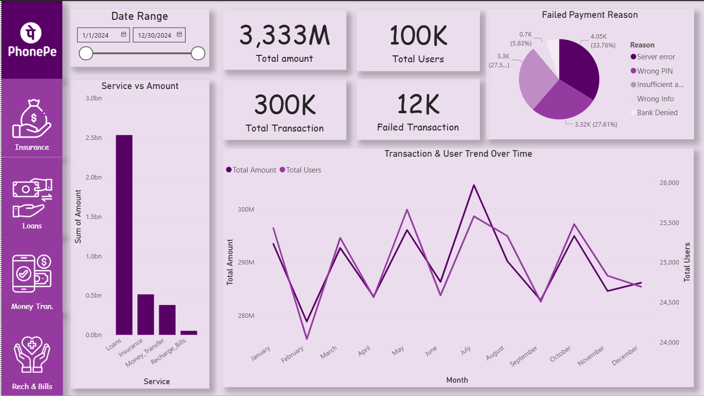
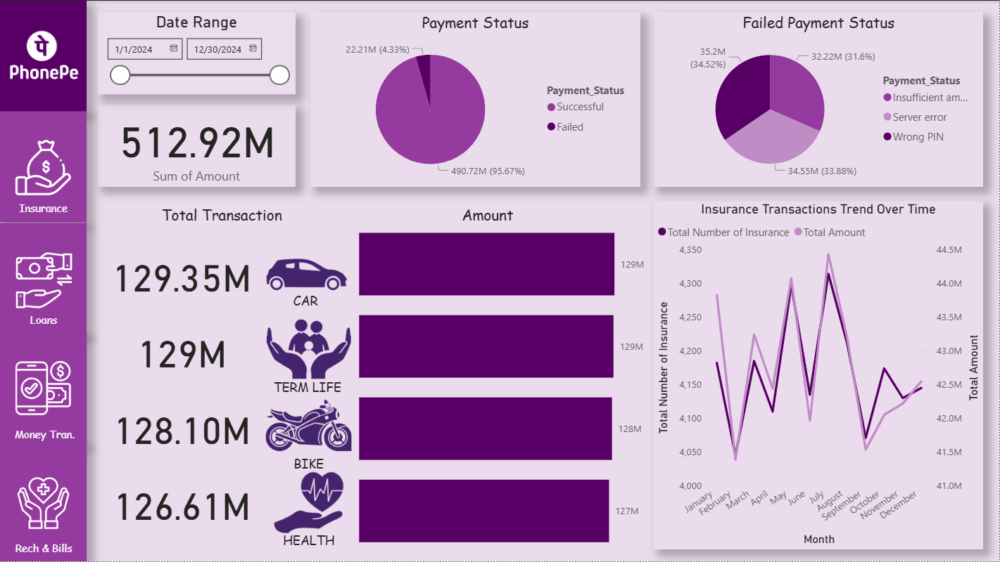
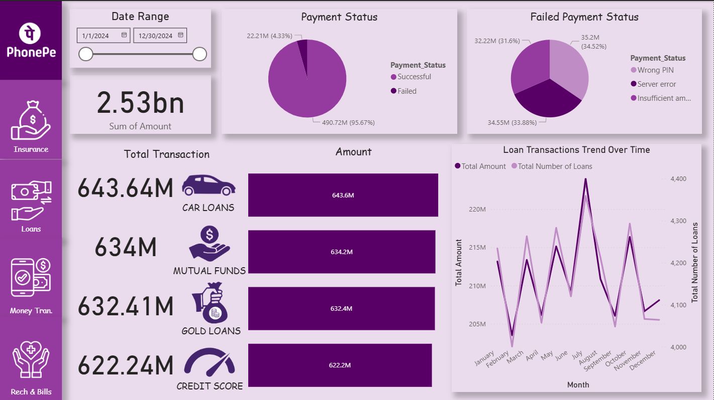
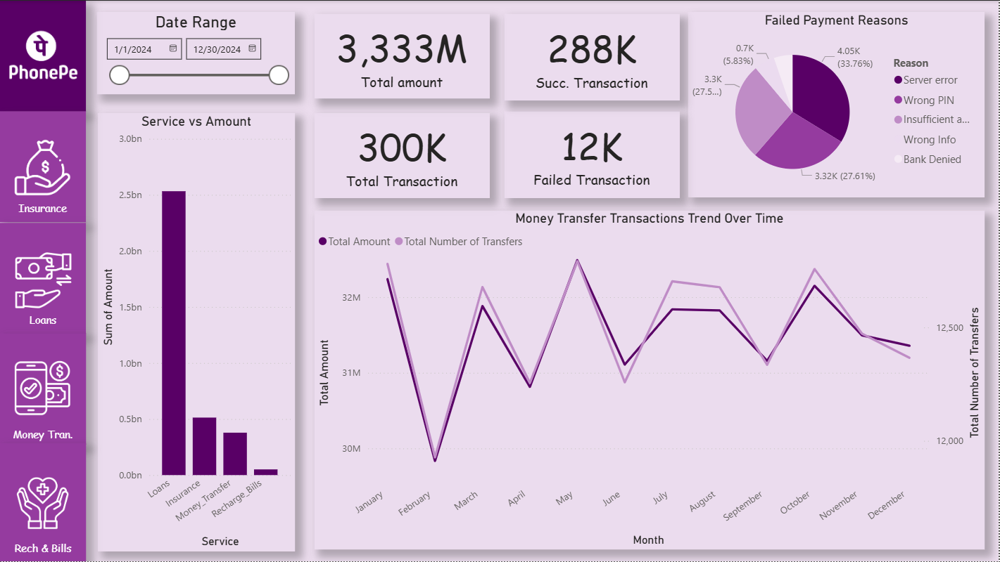
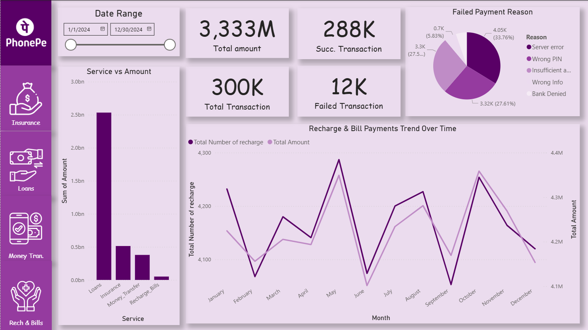

# 📊 PhonePe Financial Services Analysis Dashboard

A business-focused **Power BI dashboard project** built to analyze **digital payment activity, transaction behavior, financial service usage, and category-level performance** inspired by the PhonePe ecosystem.

This project was created to demonstrate how a fintech or digital payments company can use structured reporting and dashboarding to understand transaction patterns, user activity, and service performance through interactive business intelligence reporting.

---

## 📌 Project Overview

With the rapid growth of digital payments, businesses need structured reporting systems to understand how users interact with different financial services and transaction categories.

This dashboard was built as a practical analytics project to transform payment-related data into an interactive reporting solution that helps visualize transaction behavior and category-wise usage.

The goal was not just to create visuals, but to approach the project from a **business intelligence perspective** — focusing on how dashboard reporting can support better understanding of digital payment activity.

---

## ❗ Problem Statement

Digital payment platforms generate large amounts of transactional and service-related data.

Without proper reporting and visualization, it becomes difficult to identify:

- which services or categories are most actively used
- how transaction behavior is distributed across different segments
- what usage patterns can support business understanding
- how key transaction metrics can be monitored effectively

This project addresses that challenge by converting raw payment-related data into an interactive dashboard designed for reporting and analysis.

---

## 🎯 Business Objective

The objective of this project is to build a dashboard that helps monitor and analyze:

- Transaction activity
- Financial service usage
- Category-level contribution
- User transaction behavior
- Key business reporting KPIs

The dashboard is designed to make transaction data easier to understand, compare, and interpret.

---

## 📊 Dashboard Scope

This dashboard focuses on the following analytical areas:

### 1. Transaction Performance Monitoring
Tracks transaction activity using core business metrics such as:

- Total Transaction Count
- Total Transaction Value
- Average Transaction Value

### 2. Category / Service Analysis
Breaks down the data into categories to understand where most platform activity is happening.

This helps evaluate:

- Usage distribution
- Category contribution
- Service-level engagement

### 3. User Activity Analysis
Provides visibility into how users interact with the platform based on the available dataset.

This helps support understanding of:

- transaction behavior
- activity distribution
- user engagement patterns

### 4. Interactive Reporting
The dashboard includes filters and slicers to allow users to explore the data dynamically based on:

- Category
- Service type
- Transaction metrics

---

## 💡 Key Business Questions Answered

This dashboard is designed to help answer questions such as:

- Which categories contribute the highest transaction volume and value?
- Which services are most actively used?
- What patterns can be observed in transaction behavior?
- How is digital payment activity distributed across the available data?
- Which metrics are most useful for tracking platform activity?

These are common questions addressed in analytics, reporting, and business intelligence workflows.

---

## 🛠️ Tools & Technologies Used

- **Power BI** – dashboard development and visual analytics
- **Power Query** – data cleaning and transformation
- **DAX** – KPI calculations and business logic
- **Excel / CSV** – data preparation and source handling
- **GitHub** – documentation and project showcase

---

## 📂 Repository Structure

```bash
PhonePe-Financial-Services-Analysis-Dashboard/
│
├── images/              # Dashboard screenshots and visual assets
├── project_doc/         # Supporting project documents
├── BRD.txt              # Business Requirement Document
├── README.md            # Project documentation
```

---

## 📁 Project Documentation

This repository also includes supporting documentation to communicate the business and reporting context of the dashboard.

### Included Files
- **BRD.txt** – explains the business requirement perspective behind the project
- **project_doc/** – contains supporting project-related documents
- **images/** – stores dashboard screenshots for visual reference

This structure helps present the project in a more complete and portfolio-ready way.

---

## 🧠 Dashboard Design Approach

This project was built with a **reporting-first mindset**, not just a visualization-first approach.

The dashboard was structured around common analytics practices such as:

- KPI reporting
- category-level comparison
- service-based analysis
- business-focused data storytelling
- interactive exploration of transaction data

This makes the project more aligned with how dashboards are used in real business and product analysis scenarios.

---

## 🌍 Business Relevance

A dashboard like this can be useful in domains such as:

- **FinTech**
- **Digital Payments**
- **Financial Services**
- **Business Intelligence**
- **Product Analytics**
- **Operations & Strategy**

It demonstrates how transactional data can be converted into a usable reporting layer for performance monitoring and decision support.

---

## 📸 Dashboard Screenshots

### Home Page


### Insurance Analysis


### Loans Analysis


### Money Transfer Analysis


### Recharge & Bills Analysis


---

## 🚀 How to Use

1. Clone or download this repository
2. Open the Power BI project file (`.pbix`) if included
3. Review the dashboard pages and visuals
4. Use filters and slicers to interact with the report
5. Explore KPIs, transaction behavior, service usage, and category-level insights

---

## 🧩 Skills Demonstrated

This project demonstrates practical capability in:

- Data cleaning and transformation
- Dashboard development
- KPI reporting
- DAX-based calculations
- Business problem framing
- Analytical storytelling
- Insight communication through data visualization

---

## 📌 What This Project Demonstrates

This project reflects an understanding of how dashboards should be built not only for presentation, but for actual reporting and analytical use cases.

It demonstrates the ability to:

- convert raw data into a structured analytical view
- build dashboards around business questions
- present performance insights in a decision-friendly format

---

## 🔮 Future Enhancements

Possible future improvements include:

- More advanced DAX measures
- Additional service-level breakdowns
- Improved dashboard interactivity
- Enhanced KPI tracking
- Integration with larger or more dynamic datasets

---

## 👨‍💻 Author

**Sanjay Satishkumar**

This project is part of my portfolio in **Data Analytics, Business Intelligence, and Dashboard Development**.
